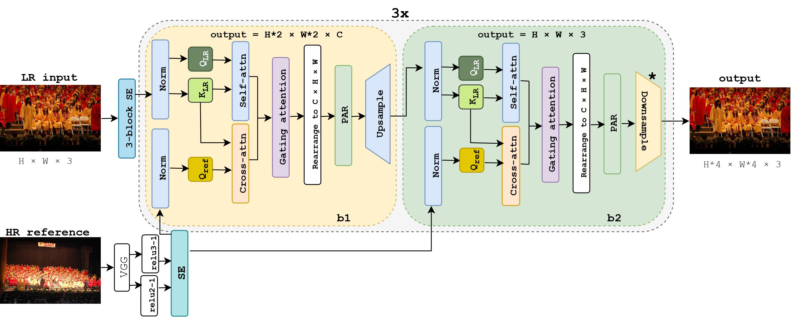

# HiTSR

This repository contains the implementation of the following paper:
> **HiTSR: A Hierarchical Transformer for Reference-based Super-Resolution**<br>
> Masoomeh Aslahishahri, Jordan Ubbens, Ian Stavness<br>

[[Paper]()]

## Overview


## Dependencies and Installation

1. Clone Repo

   ```bash
   git clone https://github.com/bia006/HiTSR.git
   ```

2. Create Conda Environment
   ```bash
   conda create --name HiTSR python=3.8
   conda activate HiTSR
   ```

3. Install Dependencies

   ```bash
   cd HiTSR
   pip install -r requirements.txt
   ```

## Dataset Preparation

- Train Set: [CUFED Dataset](https://drive.google.com/drive/folders/1hGHy36XcmSZ1LtARWmGL5OK1IUdWJi3I)
- Test Set: [WR-SR Dataset](https://drive.google.com/drive/folders/16UKRu-7jgCYcndOlGYBmo5Pp0_Mq71hP?usp=sharing), [CUFED5 Dataset](https://drive.google.com/file/d/1Fa1mopExA9YGG1RxrCZZn7QFTYXLx6ph/view)

Please refer to [Datasets.md](datasets/DATASETS.md) for pre-processing and more details.

### Test

We provide quick test code with the pretrained model.

1. Modify the paths to dataset and pretrained model in the following yaml files for configuration.

    ```bash
    ./options/test/test_HiTSR.yml
    ```

2.  Check out the results in `./results`.


### Train

All logging files in the training process, *e.g.*, log message, checkpoints, and snapshots, will be saved to `./mmsr/checkpoints` and `./tb_logger` directory.

1. Modify the paths to dataset in the following yaml files for configuration.
   ```bash
   ./options/train/train_HiTSR.yml
   ```

2. Train the transformer network.
   ```bash
   python mmsr/train.py -opt "options/train/train_HiTSR.yml"
   ```

